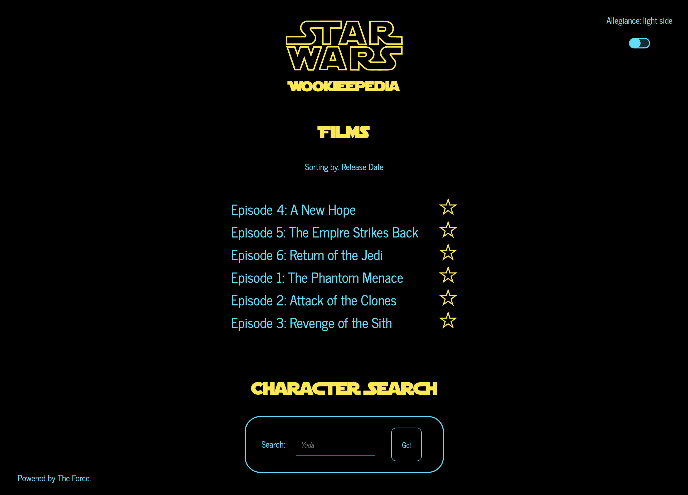

## Wookieepedia
### The Star Wars Film Database

Welcome to Wookieepedia!

Explore all the details for all your favourite Star Wars films.

[Visit site](https://star-wars-wookieepedia.vercel.app/)

## Features

- ⭐️_Star_⭐️ your favourite Star Wars films!
- View film details including character information and general film specs!
- Choose your allegiance - are you on the dark or light side?
- Search for your favourite characters!

### Coming soon

- Save your favourites! ⭐️
- Extended information on characters within the search (including films the character appears on with a link to its detail page)
- Dynamic starfield background
- Sort films by episode number or release date

#### Message to the developer

### Known issues / being worked on

- Saving favourites caused a lot of issues as I couldn't figure why the first instance a favourite was selected wouldn't be favourited. (removed film from the `filmsList` and added it to the favourites list). It was saving the user's last selection rather than the current one. This suggests to me that it was saving the `favorites` state to localStorage before the update had been made to the state though I tried a number of methods using async/await and promises in the attempt to ensure the states were updated before localStorage was updated. Would love to know why here!
- Meta image references aren't loading I believe due to SSR needing to be considered for the loading sequence of these image assets.

Thank you to [SWAPI](https://swapi.dev/) and the WM crew for making this app possible!
